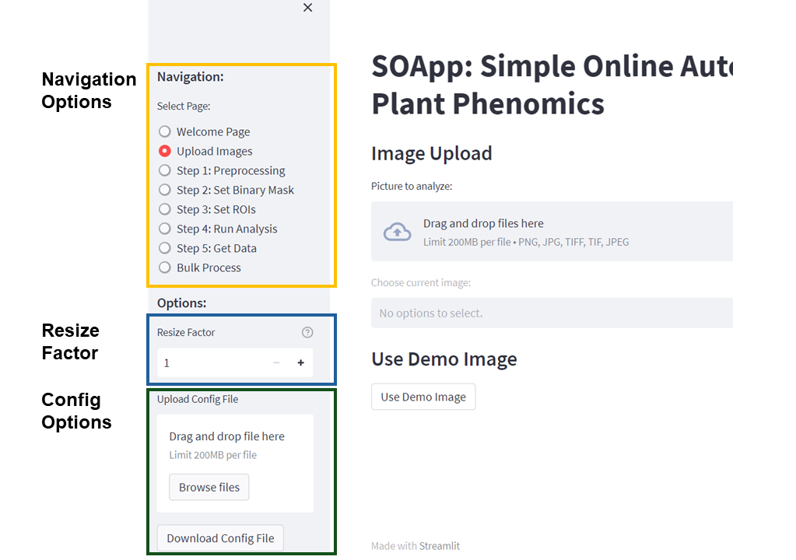

# Introduction to SOAPP


# Installing SOAPP

SOAPP runs as a Streamlit webserver on the host device. Users connect to SOAPP by connecting the remote machine running the webserver or connecting to the local webserver at

SOAPP can be installed and run in 2 different ways:

1. SOAPP Docker Image
2. Run SOAPP from Source

Installation using Docker is prefered as it does not require generating a local virtual environment for SOAPP.

**NOTE: SOAPP can only be run on arm64 CPU architecture systems (i.e.: Intel & AMD CPUs, not Apple silicon).**

## Docker Installation (Prefered)

1. Install Docker Desktop (Windows & Mac) and/or Docker (Linux)

2. Pull SOAPP Docker Image from Docker Hub

```console
docker pull lvbauer/soapp:latest
```

3. Run SOAPP webserver

```console
docker run -p 80:8501 lvbauer/soapp:latest
```

4. Connect to SOAPP locally or remotely

## Install from Source

To install from source, you will download the SOAPP code from Github, create a Python virtual environment, and run the SOAPP code from your virtual environment terminal.

Coming soon...

## Connecting to SOAPP

If SOAPP is installed locally, go to [http://localhost](http://localhost) in a browser of your choice. Google Chrome or Mozilla Firefox are recommended.

If SOAPP is installed on another computer in your network, connect to `http://soapp.host.ip.address`.

SOAPP supports multiple concurrent analysis sessions. This can be multiple devices connecting to a remotely hosted SOAPP server or multiple tabs with SOAPP open when hosting locally.

When installed remotely, you can connect to and use SOAPP from a laptop, tablet computer, or smartphone using the device's browser. Images can be taken using the device's camera app, uploaded to SOAPP, and analyzed using a single device.

# Tutorial & Example Analysis

## The SOAPP Window

First, we will get oriented with the SOAPP window. The Left Menu Bar in the SOAPP window always stays the same while the central area changes based on the selected step.

The Left Menu Bar allows you to navigate through different analysis steps in SOAPP under Navigation. 

Application options are also in the Left Menu Bar. 

Setting the `Resize Factor` option reduces the quality of display images on application window without impacting the image your are analyzing. This can speed up application use if you are using a remotely hosted SOAPP server. Leaving the Resize Factor at 1 works best in most cases.

`Upload Config File` allows you to upload settings you have saved as a JSON file. Configuration files are save as `analysis_config.json` by default.

`Download Config File` automatically downloads all current settings in a human-readable JSON file. This file can be uploaded in the above file upload box to recover and reproduce all settings for all analysis steps. It is recommended that you save your analysis settings frequently in case you lose connection with SOAPP or encounter an error.



## Step 0: Image Upload and Selection

The first step to analyzing images is uploading images!

Three options are available:

1. Upload a Single Image
2. Upload Multiple images
3. Use Demo Image

### Upload Screen


### 1. Upload Single Image

This option is used for analyzing single images and is suitable for most use cases.

To upload a single image, upload a single image using the upload block.

### 2. Upload Multiple Images

Uploading multiple images enables high-throughput processing of images, where an analysis configuration is applied automatically to the uploaded series of images. When using high-throughput processing, upload multiple images to the upload block seen above.

Once multiple image are uploaded, select a working image to configure the high-throughput analysis settings and run the bulk analysis on Bulk Process tab (Left Menu Bar).

### 3. Use Demo Image

SOAPP provides a demo image for quick experimentation. We will be using the demo image for this tutorial. Using the demo image will function identically to single image upload analysis.

To use the demo image, click the `Use Demo Image` button on the Upload Images tab in the Left Menu Bar

The demo image is originally from: [PlantCV Arabidopsis Multi-Plant Workflow](https://plantcv.readthedocs.io/en/stable/tutorials/arabidopsis_multi_plant_tutorial/).


## Step 1: Preprocessing

Preprocessing is the most variable step in using SOAPP and depends on the image being analyzed. 

### Preprocessing Options


### Tutorial

 We will be using the `Crop Image` module to slightly crop the sides of our image. 


### Preprocessing in Detail

Preprocessing allows you to make minor adjustments to your image, set color and size standards, and standardize your images using fiduciary markers. 

Preprocessing steps are modular and run inline. Each preprocessing module takes the image output by the module before it, performs a function on or using the image, then ouputs an image either for further analysis or use by the next module. Take care in choosing the order of modules to achieve the best effect for your analysis.

Coming soon...

## Step 2: Image Masking

Setting the image mask tells SOAPP what is plant tissue and what is background in your image. Your goal in this step is to represent your plants in white and the background in black.

To mask the image:

1. Select 1 or more channels which represent your plants in the extreme (mostly black or white)

2. Select `Object Color` for each mask. "Dark" is best if the plants are darker than the background, "Light" if they are lighter.

3. Set the `Threshold` parameter if using a fixed point or check `Otsu Auto-Threshold` to automatically threshold the mask. The Otsu method is suitable when a clear difference is observed between the background and the subject plants across the whole image. A `Max Value` of 255 is recommended. Adjusting `Max Value` can help reduce the dynamic range of the channel and improve masking in some cases.

4. If more than 1 mask is selected, combine the masks into 1 mask using boolean operations by selecting values for `Pick Relationship`. Masks are combined using these operators in order.

5. Clean the mask by setting `Size (# px) of object to clean up`. This removes particles smaller than the given size.

The masking tools provided in SOAPP can effectively separate plants which are distinct from their backgrounds. In the case of plants which are similar to the background, manual masking of the images with another tool may be useful prior to analysis with SOAPP.

### Tutorial 

First, we will look at the colorspace channels available for masking. We are looking for a channel where plants are depicted in mostly black or white and the background is depicted as the opposite of the plants.


The "A" channel looks suitable for our analysis. We select the "A" channel first and then configure the channel.


In the "A" channel, the plants are darker in the background so we will set `Object Color` to "dark". We will adjust `Threshold` to "105" to capture more of the plant tissue. We will not adjust `Max Value`. Using `Otsu-Auto-Threshold` may also be suitable due to the clear difference between the plants and background in the "A" channel.

Now we will clean up the small non-plant particles in our mask.


We adjust `Size (# px) of object to clean up` to be greater than 0 to remove small particles which are not out plants and may confound our measurements.

We can also preview our masked image by checking `Show Masked Image`.

We will be using the "A" channel with a single cutoff to mask our plants.

## Step 3: Setting Regions of Interest

Setting regions of interest (ROIs) tells SOAPP which shapes are your samples and which are not important for your analysis. Your goal in this step is to place the circular ROI markers over your plants, with one ROI marker indicating one sample to measure.

In this step, you may also name and include a comment on each of your plants.

__To align ROIs:__

1. Adjust the vertical and horizontal alignment. This shifts the top-left most ROI, which guides the position of the ROI grid.

2. Adjust the vertical and horizontal space to match plant spacing. This changes the spacing of the ROIs within the grid.

3. Change ROI radius to fit the size of your plat samples. Make sure ROIs are not overlapping. 

4. Set the number of rows and columns in your ROI grid to match the number and arrangement of your samples.

5. Make final tweaks and verify your ROIs are correctly aligned.

ROIs only need to cover part of a full plant if the plant mask if all parts of the plant are connected or cover part of each plant part if some parts of the plant are separated due to imperfect masking. 

It is okay if extra ROIs are created which overlap non-plant parts of the mask or do not cover anything. These extra parts can be omited from the data once collected and are automatically omitted if no masked portions are present in an ROI.

### ROI Options


### Tutorial

We will be aligning our ROI grid to our grid of plants.


This alignment will fully capture our plants even though some of the plants are not fullying included in each ROI.

## Step 4: Run Analysis

SOAPP includes multiple analysis features. Your goal is to choose the analysis tools you want to use, then run your analysis.

Morphology analysis is always performed. Other options include Color Analysis and Watershed Analysis. Once you have your options set, run your analysis.

You may also choose to include your sample names on the output morphology analysis image generated by SOAPP.

Once running, analysis progress can be monitored via a progress bar. Messages are displayed as the plants are analyzed, indicating a plant may not be present in an ROI.

Once the green "Analysis Completed" message is displayed, the analysis is complete and the data may be retrieved.

### Analysis Options


### Tutorial
We will be running morphology and color analysis on our demo image.


We see that one ROI did not contain a plant (ROI #3), and our analysis finished in just under 30 seconds.


## Step 5: Collect Data

Data collection is where the previous work pays off. The analysis page shows you the analysis image, which is useful for double checking each plant has been measured correctly. It also allows you to view and download your data, then generate and download an archive of your analysis

It is recommended you generate and download a ZIP file of your results. This ZIP file contains all of your tabulated results, the raw results JSON file, your analysis config, and pictures from intermediate steps.

### Tutorial 
Let's look at the data from our demo analysis.


At the top of the page is the analysis image, which is useful to verify each plant was measured in the way desired and not non-plant regions of the mask were included in the analysis.

In the `Data` section, morphology and color data can be downloaded as CSV files. The raw JSON file generated in PlantCV format can be downloaded as well.

In the `Download All Data` section, you can download all the data associated with your analysis. This includes data from intermediated steps and color graphs generated in addition to final color and morphology results, the analysis image, and the config JSON file. **This is the recommended way to save your data.**

Select `Show Results` to preview the data in morphology and color analysis CSV files, shown below. 


Both CSV files are structured the same: each row is a measured plant and each column a property of the plant. These columns include measurements as well as analysis metadata, including plant names, notes, and the original image name.

Morphology and Color CSV files also will include adjusted values if these features are used. When setting a scale or using automated scale features, the scaled values are included in the morphology CSV file. When a color standard is used, the standardized values are included in the color CSV file.

